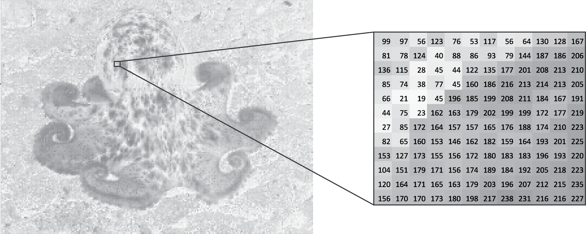

# Outlook

 - What is a computer? What is it good for?
 - The language of computers
 - Bits of data
 - How to make computers do things for you

# Before starting...

 - This lecture is super experimental! Please interrupt at any time, and let me know if you think you are not following!

# First of all...

 - What is a computer?

# From Wikipedia:

 > A computer is a machine that can be programmed to automatically carry out sequences of arithmetic or logical operations (computation).

# In other words:

 > A machine that can think for you...

# In other words:

 > ...if you ask politely!

# Dull tools

 - Many times, we use computers without really having them do stuff for us:
   - ...

# Dull tools

 - Many times, we use computers without really having them do stuff for us:

   - reading documents
   - writing documents
   - checking a calendar
   - looking at pictures
   - ...

# Dull tools

 (Of course, there are a lot of computery things happening under the hood. But they are not what we actually care about!)

# Smart tools

 - Some other times, we do leverage quick operations that they can do:
   - ...

# Smart tools

 - Some other times, we do leverage quick operations that they can do:
   - searching through files
   - transmitting information around the world
   - ...in general, do math!

# Turing completeness

 - The cool thing about computers: *in principle* they can do _anything_ you can do with your brain*
 
 *Warning: endless philosophical debates are still ongoing here!

# Computer programs and computer programs

 - If you have never coded, you probably call computer programs applications you use: Word, Excel, Chrome, etc.
 - Here we use a different, more abstract definition: a computer program is a sequence of instructions that the computer can follow to do stuff

# Writing programs

 - through applications, we use a computer in ways that were designed by someone else
 - To turn a computer into a really useful thing, we want to _learn how to ask it to do things that nobody asked before_
 - Basically, we want to avoid click things and write stuff!

# Writing programs

 - We need to learn how to _write a program_
 - Programs: a sequence of instructions that the computer can follow to do stuff

# Why writing programs can be hard?

 - talking to computers is basically just like talking to a child...

# Why writing programs can be hard?

 - ...which by the way happens to be a toaster

# Binary storage: the building blocks of programs

 - Everything the computer operates on must be "physically represented" somewhere in the computer
 - This happens by having a _lot_ of tiny "light bulbs" that can be turned on and off within the memory of the computer
 - Each light bulb can be in one of two states: on or off
 - We can use these light bulbs to store numbers using _binary code_

# Binary arithmetic

 - In binary, we only have two digits: 0 and 1
 - In binary, we can only count with 1s and 0s: 0, 1, 10, 11, 100, 101, 110, 111, 1000, etc.

# Bits and bytes

 - A _bit_ is the smallest unit of information: it can be either 0 or 1
 - Since we can do little with 1 bit, we usually think in terms of _bytes_, which are 8 bits
 - We can use bits and bytes to represent any kind of information!

# Translating to binary

 - Any kind of data has to be converted:
    - 1. To a finite sequence of numbers
    - 2. To a sequence of 0s and 1s, so that our hardware can store it

# Example: text

 - Can we come up with a way to represent _"This text"_ in a computer?

# Example: text

 - To represent a text, we have to:
    1. Split it in a sequence of characters
    2. Convert each character to a number
    3. Store the numbers, for all characters, in a binary format

# Example: images

:::: {.columns}
::: {.column width=50%}
 - Can we come up with a way to represent this image in a computer?
:::

::: {.column width=50%}

:::
::::

# Example: images

:::: {.columns}
::: {.column width=50%}
 - To represent an image, we have to:
    1. Split it in a grid of pixels
    2. For each pixel, find the intensity of the light for different color channels
    3. Convert each intensity to a number
    4. Store the numbers, for all colors and for all pixels, in a binary format
:::

::: {.column width=50%}

:::
::::

# Example: your data
 - ...

# File formats

In your computer, you store data in many different formats. Each file ultimetely consists just of 0s and 1s, and its format tells you how to interpret that sequence!

 - Corollary: most file types can be read one way or another, given a flexible enough tool! (eg Python)

# An interesting duality

 - Keep in mind: programs are themselves data! 

# The end
